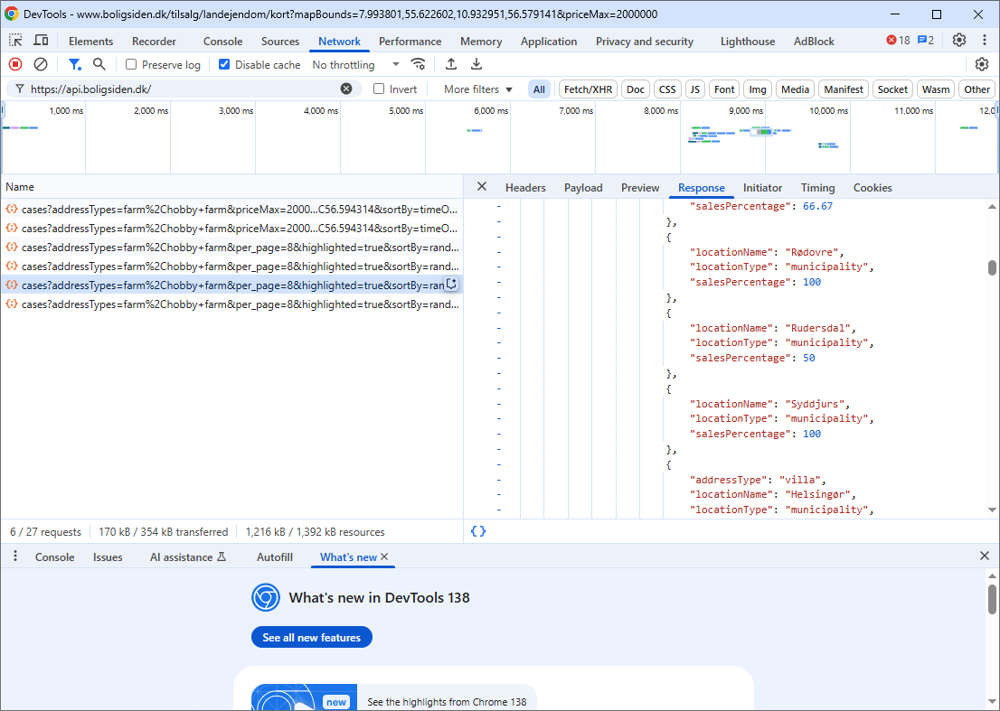
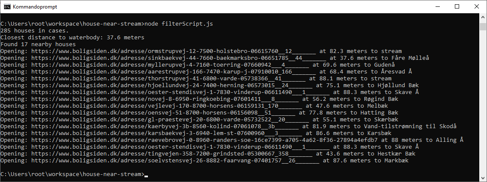
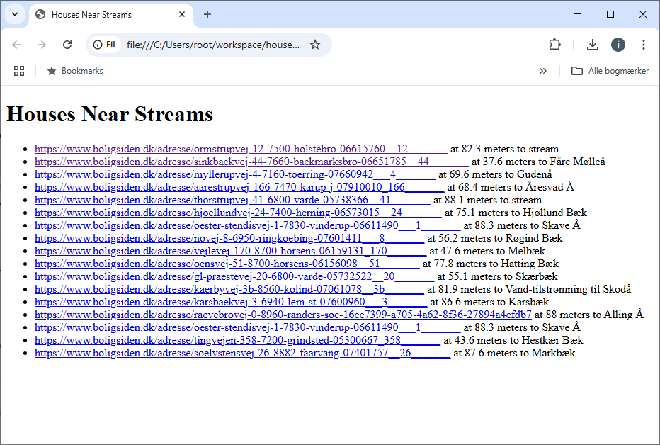

# Find a house for sale in Denmark near a stream

##

* Install nodeJS from https://nodejs.org/en/download to run the script.


## Download data from boligsiden

* Go to https://www.boligsiden.dk/tilsalg/landejendom/kort?mapBounds=8.548931,55.856524,10.354922,56.443551&splitViewPage=3&priceMax=2000000
* Hit F12 and go to network tab and clear it.
* On the map zoom to trigger an update.
* Click each line from the bottom of the network tab to find the first one that has JSON in the Response tab.
* Copy (ctrl+a -> ctrl+c) and paste it into the houses.json file and save.



## Download water body data from overpass-turbo

* Go to https://overpass-turbo.eu/
Paste search

```
[out:json][timeout:1800];
area["ISO3166-1"="DK"][admin_level=2]->.searchArea;
(
  way["waterway"~"river|stream"](area.searchArea);
  relation["waterway"~"river|stream"](area.searchArea);
);
out body;
>;
out skel qt;
```
* Export as geojson
* Save as 'waterbodies_dk.geojson' (already in this repo)


## Filter data

* Run ```npm install```
* Run ```node filterScript.js```

Results will either open in your browser or save a results.html file depending on how you modify the script:





